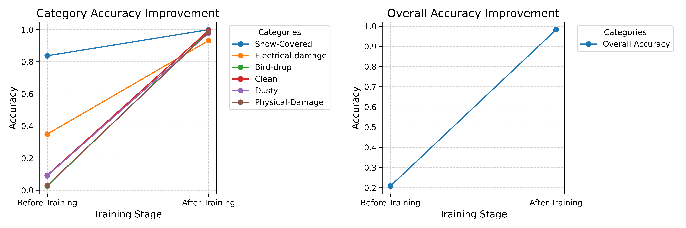

# VLM for Image Classification

### —— Finetune SmolVLM-Instruct for Image classification in specific fields

<a href="#cn">中文介绍</a>

---

<!-- Navigation -->
<ul>
  <li><a href="#introduction">Introduction</a>
    <ul>
      <li><a href="#potential-of-small-parameter-vlms">Potential of Small-Parameter VLMs in Specific Image Domains</a></li>
      <li><a href="#low-latency-deployment">Low-Latency Deployment with Consumer-Grade GPUs</a></li>
    </ul>
  </li>
  <li><a href="#repository-structure">Repository Structure</a>
    <ul>
      <li><a href="#download_datasetpy">1. download_dataset.py</a></li>
      <li><a href="#generate_train_jsonpy">2. generate_train_json.py</a></li>
      <li><a href="#fine_tunepy">3. fine_tune.py</a></li>
      <li><a href="#vlm_benchmark_test_datasetpy">4. vlm_benchmark_test_dataset.py</a></li>
      <li><a href="#vlm_testpy">5. vlm_test.py</a></li>
    </ul>
  </li>
  <li><a href="#usage-guide">Usage Guide</a></li>
  <li><a href="#training-results-example">Training Results Example</a></li>
</ul>

---

## Introduction
<a id="introduction"></a>

This repository provides end-to-end code for dataset creation, model fine-tuning, and evaluation workflows. While specifically designed for [SmolVLM-256M-Instruct](https://huggingface.co/HuggingFaceTB/SmolVLM-256M-Instruct), the framework supports other Vision Language Models (VLMs) and is tailored for the [Solar panel clean and faulty images](https://www.kaggle.com/datasets/pythonafroz/solar-panel-clean-and-faulty-images) dataset on Kaggle, with potential for domain adaptation.

### Potential of Small-Parameter VLMs in Specific Image Domains
<a id="potential-of-small-parameter-vlms"></a>

Fine-tuning improves classification accuracy from **0.2** to over **0.98+** on this dataset. 



### Low-Latency Deployment with Consumer-Grade GPUs
<a id="low-latency-deployment"></a>

Small-parameter VLMs demonstrate exceptional efficiency:
- Minimum VRAM consumption: **4.5GB** during fine-tuning (with `batch_size=1`)
- Scalable via `per_device_train_batch_size` and `per_device_eval_batch_size` adjustments in `fine_tune.py`

The models show remarkable deployment efficiency:
- [SmolVLM-256M-Instruct](https://huggingface.co/HuggingFaceTB/SmolVLM-256M-Instruct) requires only **1.2GB GPU memory** at `bfloat16` precision
- Quantized to `INT4` format: just **0.6GB VRAM**

---

## Repository Structure
<a id="repository-structure"></a>

### &emsp;1. `download_dataset.py`
<a id="download_datasetpy"></a>
Downloads the [Solar panel clean and faulty images](https://www.kaggle.com/datasets/pythonafroz/solar-panel-clean-and-faulty-images) dataset from Kaggle directly to your project root directory.

### &emsp;2. `generate_train_json.py`
<a id="generate_train_jsonpy"></a>
Generates training JSON files from local data:
1. Scans subfolders in dataset root as class labels
2. Iterates through image files
3. Combines question templates with class descriptions to generate Q&A pairs, including direct classification prompts
4. Splits data (default: 80% train/20% test)
5. Saves JSON files in script directory

### &emsp;3. `fine_tune.py`
<a id="fine_tunepy"></a>
Main fine-tuning script that produces trained models and training logs.

#### Key Parameters:
```python
# Path configurations
local_model_path = "./SmolVLM-256M-Instruct"  # Local model directory
train_json_path = "solar_panel_train_dataset.json"  # Training JSON
test_json_path = "solar_panel_test_dataset.json"  # Test JSON
output_dir = "./SmolVLM-256M-Instruct-finetuned"  # Output directory

# Training configuration
equivalent_epochs_to_train = 1
per_device_train_batch_size = 4
per_device_eval_batch_size = 4
gradient_accumulation_steps = 4
warmup_steps = 50
learning_rate = 3e-4
weight_decay = 0.01
logging_steps = 25
```

### &emsp;4. `vlm_benchmark_test_dataset.py`
<a id="vlm_benchmark_test_datasetpy"></a>
Evaluates VLM performance on the test dataset, reporting final accuracy metrics.

### &emsp;5. `vlm_test.py`
<a id="vlm_testpy"></a>
Full dataset evaluation script. Defaults to using `./SmolVLM-256M-Instruct` - modify `model_name` variable to evaluate fine-tuned models.

### Directory Structure:
```bash
├── download_dataset.py
├── generate_train_json.py
├── fine_tune.py
├── vlm_benchmark_test_dataset.py
├── vlm_test.py
├── solar_panel_test_dataset.json
├── solar_panel_train_dataset.json
├── README.md
├── requirements.txt
├── SmolVLM-256M-Instruct/
│   └── model_files
├── SmolVLM-256M-Instruct-finetuned/
│   └── finetuned_model_files
└── Faulty_solar_panel/  # Dataset root
    ├── Category/
    └── Images.jpg
```

---

## Usage Guide
<a id="usage-guide"></a>

### Environment Setup
1. Create virtual environment:
```bash
conda create -n vlm python=3.10
```
2. Activate environment:
```bash
conda activate vlm
```

### Project Installation
1. Clone repository:
```bash
git clone https://github.com/stlin256/VLM4Classification.git
```
2. Navigate to project directory:
```bash
cd VLM4Classification
```
3. Install dependencies:
```bash
python -m pip install --upgrade pip
pip install -r requirements.txt
```
**Pay attention to PyTorch installation!**

### Data Preparation
1. Download [SmolVLM-256M-Instruct](https://huggingface.co/HuggingFaceTB/SmolVLM-256M-Instruct) to `./SmolVLM-256M-Instruct`
2. Download dataset:
```bash
python download_dataset.py
```


### Dataset Processing
```bash
python generate_train_json.py
```

### Training
***Verify batch size settings (`per_device_train_batch_size`, `per_device_eval_batch_size`) before execution***
```python
# ~4.5GB VRAM
per_device_train_batch_size = 1
per_device_eval_batch_size = 1

# ~14GB VRAM
per_device_train_batch_size = 4
per_device_eval_batch_size = 4
```
Run training:
```bash
python fine_tune.py
```

### Evaluation Protocols
1. Base model full evaluation:
```bash
python vlm_test.py
```

2. Fine-tuned model test set evaluation:
```bash
python vlm_benchmark_test_dataset.py
```

3. Full evaluation of fine-tuned model:
```bash
# Modify model_name variable first
python vlm_test.py
```
# Training Results Example
<a id="training-results-example"></a>

The following parameters were used for training:
```python
#generate_train_json.py

    train_set_ratio = 0.8

#finetune.py

 #SFTConfig
    equivalent_epochs_to_train = 1  
    per_device_train_batch_size = 4
    per_device_eval_batch_size = 4
    gradient_accumulation_steps = 4
    warmup_steps = 50
    learning_rate = 3e-4
    weight_decay = 0.01
```

Full evaluation before training:
```python
# vlm_test.py
--- Category Accuracy Results ---
type:Snow-Covered,correct__rate:0.8373983739837398
type:Electrical-damage,correct__rate:0.34951456310679613
type:Bird-drop,correct__rate:0.02617801047120419
type:Clean,correct__rate:0.09326424870466321
type:Dusty,correct__rate:0.08994708994708994
type:Physical-Damage,correct__rate:0.028985507246376812
--- Overall Accuracy ---
Total Correct: 181/868, Accuracy: 0.2085
```

Full evaluation after training:
```python
# vlm_test.py 
--- Category Accuracy Results ---
type:Snow-Covered,correct__rate:1.0
type:Electrical-damage,correct__rate:0.9320388349514563
type:Bird-drop,correct__rate:0.9895287958115183
type:Clean,correct__rate:0.9948186528497409
type:Dusty,correct__rate:0.9788359788359788
type:Physical-Damage,correct__rate:0.9855072463768116
--- Overall Accuracy ---
Total Correct: 853/868, Accuracy: 0.9827
```

Evaluation on test dataset after training:
```python
# vlm_benchmark_test_dataset.py

--- Category Accuracy Results ---
type:Electrical-damage,correct_rate:0.8571 (18/21)
type:Snow-Covered,correct_rate:1.0000 (27/27)
type:Dusty,correct_rate:0.9574 (45/47)
type:Bird-drop,correct_rate:1.0000 (46/46)
type:Clean,correct_rate:1.0000 (31/31)
type:Physical-Damage,correct_rate:1.0000 (15/15)

--- Overall Accuracy ---
Total Correct: 182/187, Accuracy: 0.9733
```

---

---
<div id="cn"></div>

# VLM for Image Classification

### —— 微调SomlVLM模型用于图像分类问题

---

<!-- 目录导航 -->
<ul>
  <li><a href="#介绍">介绍</a>
    <ul>
      <li><a href="#展现了小参数量vlm在特定图像领域分类的潜力">展现了小参数量VLM在特定图像领域分类的潜力</a></li>
      <li><a href="#小参数量vlm延迟低性能要求低在消费级gpu上轻松微调">小参数量VLM延迟低，性能要求低，在消费级GPU上轻松微调</a></li>
    </ul>
  </li>
  <li><a href="#仓库文件介绍">仓库文件介绍</a>
    <ul>
      <li><a href="#download_datasetpy">1. download_dataset.py</a></li>
      <li><a href="#generate_train_jsonpy">2. generate_train_json.py</a></li>
      <li><a href="#fine_tunepy">3. fine_tune.py</a></li>
      <li><a href="#vlm_benchmark_test_datasetpy">4. vlm_benchmark_test_dataset.py</a></li>
      <li><a href="#vlm_testpy">5. vlm_test.py</a></li>
    </ul>
  </li>
  <li><a href="#使用方式">使用方式</a></li>
  <li><a href="#训练结果示例">训练结果示例</a></li>
</ul>

---

## 介绍

 &emsp;&emsp;这个代码仓库提供了从创建数据集、微调、评估的全流程代码。适用于[SmolVLM-256M-Instruct](https://huggingface.co/HuggingFaceTB/SmolVLM-256M-Instruct  )以及其它VLM，适用于Kaggle上的[Solar panel clean and faulty images](https://www.kaggle.com/datasets/pythonafroz/solar-panel-clean-and-faulty-images  )数据集，并可迁移使用。
 
### 展现了小参数量VLM在特定图像领域分类的潜力：
<a id="展现了小参数量vlm在特定图像领域分类的潜力"></a>

 &emsp;&emsp;通过微调，模型在这个数据集上的分类精确度从 **0.2** 提升到了大于 **0.98**！


### 小参数量VLM延迟低，性能要求低，在消费级GPU上轻松微调：
<a id="小参数量vlm延迟低性能要求低在消费级gpu上轻松微调"></a>

 &emsp;&emsp;小参数量VLM微调时对显存大小要求低，本仓库微调脚本最低**仅消耗4.5G显存**。(当`batch_size`被设置为1的时候)
 
 &emsp;&emsp;你可以通过调整`fine_tune.py`中的`per_device_train_batch_size`和`per_device_eval_batch_size`来优化显存占用。
 
 小参数量VLM使用时对算力和显存大小要求低，对端侧部署十分友好，[SmolVLM-256M-Instruct](https://huggingface.co/HuggingFaceTB/SmolVLM-256M-Instruct  )在以`bfloat16`精度下推理时只需1.2G显存，使用`INT4`量化时只需0.6G显存。

---
## 仓库文件介绍：
<a id="仓库文件介绍"></a>

### &emsp;1. `download_dataset.py` 
<a id="download_datasetpy"></a>
&emsp;&emsp;&emsp;用于从[Kaggle](https://www.kaggle.com  )下载[Solar panel clean and faulty images](https://www.kaggle.com/datasets/pythonafroz/solar-panel-clean-and-faulty-images  )数据集。

&emsp;&emsp;&emsp;&emsp;直接运行即可，数据集文件夹会被下载到项目文件夹根目录

### &emsp;2. `generate_train_json.py`
<a id="generate_train_jsonpy"></a>
&emsp;&emsp;&emsp;用于从本地文件创建用于训练的json文件，工作原理如下： 

&emsp;&emsp;&emsp;&emsp;1.从数据集根文件夹开始，搜寻子文件夹，并以子文件夹名为类名

&emsp;&emsp;&emsp;&emsp;2.遍历子文件夹中的文件。

&emsp;&emsp;&emsp;&emsp;3.将问题列表与各类别细节描述进行组合，生成QA对，同时固定生成一个仅包含类别名称回答的QA对。

&emsp;&emsp;&emsp;&emsp;4.打乱顺序，分割训练集和测试集(默认80%与20%)

&emsp;&emsp;&emsp;&emsp;5.将json文件保存到脚本同级目录中。

### &emsp;3. `fine_tune.py`
<a id="fine_tunepy"></a>
&emsp;&emsp;&emsp;用于进行模型微调

&emsp;&emsp;&emsp;&emsp;此脚本将会执行模型的微调工作，并给出微调好的模型文件和记录到的日志。

#### &emsp;&emsp;&emsp;&emsp;参数说明：

```python
  #路径信息
    local_model_path = "./SmolVLM-256M-Instruct" #基座模型目录(为了加载方便，脚本从本地目录加载)
    train_json_path = "solar_panel_train_dataset.json" #训练集json
    test_json_path = "solar_panel_test_dataset.json" #测试集json
    output_dir = "./SmolVLM-256M-Instruct-finetuned" #微调输出目录
  #SFTConfig(主要部分)
    equivalent_epochs_to_train = 1  #等效epoch数
    per_device_train_batch_size = 4 #训练批量大小
    per_device_eval_batch_size = 4 #评估批量大小
    gradient_accumulation_steps = 4 #梯度累加
    warmup_steps = 50 #热身步数
    learning_rate = 3e-4 #初始学习率
    weight_decay = 0.01 #权重衰减
    logging_steps = 25 #日志记录间隔
```

### &emsp;4. `vlm_benchmark_test_dataset.py`
<a id="vlm_benchmark_test_datasetpy"></a>
&emsp;&emsp;&emsp;此脚本用于从测试集中评估vlm模型的性能，最终给出模型的正确率。

### &emsp;5. `vlm_test.py`
<a id="vlm_testpy"></a>
&emsp;&emsp;&emsp;此脚本用于使用整个数据集对模型进行评估，最终给出模型的正确率。

&emsp;&emsp;&emsp;此脚本默认使用的是`./SmolVLM-256M-Instruct`中的模型，如果你需要对微调好的模型进行评估，请你修改`model_name`变量。

### 完整的文件树：
```bash
├── download_dataset.py
├── generate_train_json.py
├── fine_tune.py
├── vlm_benchmark_test_dataset.py
├── vlm_test.py
├── solar_panel_test_dataset.json
├── solar_panel_train_dataset.json
├── README.md
├── requirements.txt
├── SmolVLM-256M-Instruct
│   └── model_files
├── SmolVLM-256M-Instruct-finetuned
│   └── finetuned model_files
└── Faulty_solar_panel  #dataset root dir
     ├── Category
     └─── Images.jpg
```
---
## 使用方式：
<a id="使用方式"></a>

### 配置虚拟环境
1.创建虚拟环境
```bash
conda create -n vlm python=3.10
```
2.激活虚拟环境
```bash
conda activate vlm
```
### 2.克隆本项目并安装依赖

1.从Github克隆本项目
```bash
git clone https://github.com/stlin256/VLM4Classification.git
```
2.打开项目文件夹
```bash
cd VLM4Classification
```
3.安装依赖
```bash
python -m pip install --upgrade pip
pip install -r requirements.txt
```
**务必注意torch的安装！**

### 3.下载所需的文件
1.从[SmolVLM-256M-Instruct](https://huggingface.co/HuggingFaceTB/SmolVLM-256M-Instruct  )下载模型文件，保存到`./SmolVLM-256M-Instruct`中。

2.下载数据集

运行脚本
```bash
python download_dataset.py
```
如果报404错误，则请检查互联网连接或者代理设置。

### 4.创建训练所用的json文件
运行脚本
```bash
python generate_train_json.py
```

### 5.进行训练
***在运行前请检查批量大小设置，即`per_device_train_batch_size`和`per_device_eval_batch_size`变量。***
```python
#占用约4.5G显存
per_device_train_batch_size = 1
per_device_eval_batch_size = 1
#占用约14G显存
per_device_train_batch_size = 4
per_device_eval_batch_size = 4
```
运行脚本
``` bash
python fine_tune.py
```
在运行过程中，脚本会输出训练进度、剩余时间、损失、梯度、学习率等信息

各变量的作用请参照前文
### 6.评估（基于准确率）

1)对原始模型进行完整评估
```
python vlm_test.py
```
2)使用测试集对微调模型进行评估
```
python vlm_benchmark_test_dataset.py
```
3)对微调模型进行完整评估

将`model_name`变量的值修改为`"./SmolVLM-256M-Instruct-finetuned"`
```
python vlm_test.py
```

---
# 训练结果示例
使用以下参数进行训练：
```python
#generate_train_json.py

    train_set_ratio = 0.8

#finetune.py

 #SFTConfig
    equivalent_epochs_to_train = 1  
    per_device_train_batch_size = 4
    per_device_eval_batch_size = 4
    gradient_accumulation_steps = 4
    warmup_steps = 50
    learning_rate = 3e-4
    weight_decay = 0.01
```
训练前全量评估
```python
#vlm_test.py
--- Category Accuracy Results ---
type:Snow-Covered,correct__rate:0.8373983739837398
type:Electrical-damage,correct__rate:0.34951456310679613
type:Bird-drop,correct__rate:0.02617801047120419
type:Clean,correct__rate:0.09326424870466321
type:Dusty,correct__rate:0.08994708994708994
type:Physical-Damage,correct__rate:0.028985507246376812
--- Overall Accuracy ---
Total Correct: 181/868, Accuracy: 0.2085
```
训练后全量评估
```python
#vlm_test.py
--- Category Accuracy Results ---
type:Snow-Covered,correct__rate:1.0
type:Electrical-damage,correct__rate:0.9320388349514563
type:Bird-drop,correct__rate:0.9895287958115183
type:Clean,correct__rate:0.9948186528497409
type:Dusty,correct__rate:0.9788359788359788
type:Physical-Damage,correct__rate:0.9855072463768116
--- Overall Accuracy ---
Total Correct: 853/868, Accuracy: 0.9827
```
训练后在测试集上的评估
```python
#vlm_benchmark_test_dataset.py

--- Category Accuracy Results ---
type:Electrical-damage,correct_rate:0.8571 (18/21)
type:Snow-Covered,correct_rate:1.0000 (27/27)
type:Dusty,correct_rate:0.9574 (45/47)
type:Bird-drop,correct_rate:1.0000 (46/46)
type:Clean,correct_rate:1.0000 (31/31)
type:Physical-Damage,correct_rate:1.0000 (15/15)

--- Overall Accuracy ---
Total Correct: 182/187, Accuracy: 0.9733
```
---