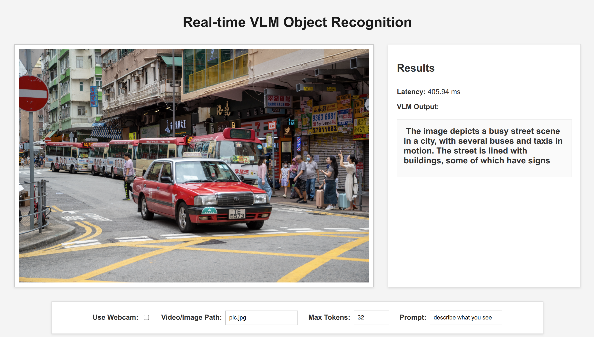

# Real-Time VLM Visual Analysis Web App

### —— A web application for real-time visual analysis using Vision Language Models

<a href="#cn">中文介绍</a>

---

<!-- Navigation -->
<ul>
  <li><a href="#introduction">Introduction</a>
    <ul>
      <li><a href="#features">Features</a></li>
    </ul>
  </li>
  <li><a href="#repository-structure">Repository Structure</a></li>
  <li><a href="#usage-guide">Usage Guide</a>
    <ul>
      <li><a href="#environment-setup">Environment Setup</a></li>
      <li><a href="#installation">Installation</a></li>
      <li><a href="#running-the-application">Running the Application</a></li>
    </ul>
  </li>
  <li><a href="#configuration">Configuration</a></li>
  <li><a href="#demo">Demo</a></li>
</ul>

---

## Introduction
<a id="introduction"></a>

This project provides a complete web application that leverages a Vision Language Model (VLM) to perform real-time analysis of visual content. The application can capture video from a webcam, a video file, or use a static image as input. It continuously processes the visual feed, generates textual descriptions using the VLM, and displays the video stream, the model's output, and the processing FPS on a responsive web interface. All major settings can be configured dynamically through the web UI.

### Features
<a id="features"></a>
- **Multi-Source Input**: Supports real-time video capture from a webcam, looping playback from a video file, or analysis of a static image.
- **Dynamic Web UI Configuration**: Easily switch between webcam and file input, change the file path, adjust the model's `max_new_tokens`, and modify the `prompt` directly from the web page, with changes taking effect instantly.
- **Real-Time VLM Inference**: Continuously sends frames to the VLM for analysis and description generation.
- **Web Interface**: A clean, responsive web UI that displays the visual source, real-time FPS, and the VLM's textual output side-by-side.
- **Asynchronous Processing**: Utilizes multithreading to handle frame capture and VLM inference in parallel, maximizing performance.

---

## Repository Structure
<a id="repository-structure"></a>

```bash
.
├── realtime_vlm_app.py     # Main Flask application script
├── templates/
│   └── index.html          # HTML template for the web interface
├── requirements.txt        # Python dependencies
└── README.md               # This file
```

---

## Usage Guide
<a id="usage-guide"></a>

### Environment Setup
<a id="environment-setup"></a>
It is recommended to use a virtual environment (e.g., conda or venv).

1.  **Create a virtual environment** (example with conda):
    ```bash
    conda create -n vlm_webapp python=3.10
    ```
2.  **Activate the environment**:
    ```bash
    conda activate vlm_webapp
    ```

### Installation
<a id="installation"></a>
1.  **Clone the repository**:
    ```bash
    git clone https://github.com/stlin256/VLM_Live.git
    cd VLM_Live
    ```
2.  **Install PyTorch**: Visit the [official PyTorch website](https://pytorch.org/get-started/locally/) and install a version compatible with your CUDA setup.
3.  **Install dependencies**:
    ```bash
    pip install -r requirements.txt
    ```
4.  **Download the VLM model**: Ensure you have the `SmolVLM-256M-Instruct` model files in a directory named `SmolVLM-256M-Instruct` at the project root.
5.  **Prepare media files**: Place any video or image files you want to use (e.g., `pic.jpg`, `a.mp4`) in the project's root directory.

### Running the Application
<a id="running-the-application"></a>
1.  **Start the server**:
    ```bash
    python realtime_vlm_app.py
    ```
2.  **Open your browser**: The terminal will display the access link. Navigate to `http://127.0.0.1:5000` to view the application.

---

## Configuration
<a id="configuration"></a>
Initial default settings are defined at the top of `realtime_vlm_app.py`. However, all key parameters can be adjusted dynamically via the settings panel on the web page itself.

- **Use Webcam**: Check this box to switch to the webcam feed. The file path input will be disabled.
- **Video/Image Path**: Specify the path to a video or image file located in the project directory.
- **Max Tokens**: Control the maximum length of the VLM's generated response.
- **Prompt**: Change the question or instruction given to the VLM.

Changes are applied instantly upon modification.

---

## Demo
<a id="demo"></a>
The web interface displays the video feed on the left and the analysis results on the right. Below the main view, a settings panel allows for dynamic configuration of the application.



---
---
<div id="cn"></div>

# 实时 VLM 视觉分析 Web 应用

### —— 一个使用视觉语言模型进行实时视觉分析的Web应用

---

<!-- 目录导航 -->
<ul>
  <li><a href="#中文介绍">介绍</a>
    <ul>
      <li><a href="#功能特性">功能特性</a></li>
    </ul>
  </li>
  <li><a href="#仓库结构">仓库结构</a></li>
  <li><a href="#使用指南">使用指南</a>
    <ul>
      <li><a href="#环境设置">环境设置</a></li>
      <li><a href="#安装">安装</a></li>
      <li><a href="#运行应用">运行应用</a></li>
    </ul>
  </li>
  <li><a href="#配置">配置</a></li>
  <li><a href="#演示">演示</a></li>
</ul>

---

## 介绍
<a id="中文介绍"></a>

本项目提供了一个完整的Web应用程序，它利用视觉语言模型（VLM）对视觉内容进行实时分析。该应用可以从网络摄像头、视频文件捕获视频，或使用静态图像作为输入。它会持续处理视觉输入，使用VLM生成文本描述，并在一个响应式的Web界面上并排显示视频流、模型的输出以及处理的FPS。所有主要设置都可以通过Web UI动态配置。

### 功能特性
<a id="功能特性"></a>
- **多源输入**: 支持从网络摄像头进行实时视频捕获、循环播放视频文件，或分析静态图像。
- **动态Web UI配置**: 可在网页上轻松切换摄像头和文件输入、更改文件路径、调整模型的 `max_new_tokens` 以及修改 `prompt`，所有更改即时生效。
- **实时VLM推理**: 持续将视频帧发送给VLM进行分析并生成描述。
- **Web界面**: 一个简洁、响应式的Web UI，可并排显示视觉源、实时FPS和VLM的文本输出。
- **异步处理**: 利用多线程并行处理帧捕获和VLM推理，以最大化性能。

---

## 仓库结构
<a id="仓库结构"></a>

```bash
.
├── realtime_vlm_app.py     # 主Flask应用脚本
├── templates/
│   └── index.html          # Web界面的HTML模板
├── requirements.txt        # Python依赖项
└── README.md               # 本文件
```

---

## 使用指南
<a id="使用指南"></a>

### 环境设置
<a id="环境设置"></a>
建议使用虚拟环境（例如 conda 或 venv）。

1.  **创建虚拟环境** (使用 conda 的示例):
    ```bash
    conda create -n vlm_webapp python=3.10
    ```
2.  **激活环境**:
    ```bash
    conda activate vlm_webapp
    ```

### 安装
<a id="安装"></a>
1.  **克隆仓库**:
    ```bash
    git clone https://github.com/stlin256/VLM_Live.git
    cd VLM_Live
    ```
2.  **安装 PyTorch**: 访问 [PyTorch 官网](https://pytorch.org/get-started/locally/) 并安装与您的 CUDA 环境兼容的版本。
3.  **安装依赖**:
    ```bash
    pip install -r requirements.txt
    ```
4.  **下载VLM模型**: 确保您已将 `SmolVLM-256M-Instruct` 模型文件放置在项目根目录下名为 `SmolVLM-256M-Instruct` 的文件夹中。
5.  **准备媒体文件**: 将您希望使用的任何视频或图片文件（例如 `pic.jpg`, `a.mp4`）放置在项目根目录中。

### 运行应用
<a id="运行应用"></a>
1.  **启动服务器**:
    ```bash
    python realtime_vlm_app.py
    ```
2.  **打开浏览器**: 终端会显示应用的访问链接。请访问 `http://127.0.0.1:5000` 查看应用。

---

## 配置
<a id="配置"></a>
初始的默认设置在 `realtime_vlm_app.py` 的顶部定义。然而，所有关键参数都可以在网页本身的设置面板中动态调整。

- **Use Webcam**: 勾选此框以切换到摄像头画面。文件路径输入框将被禁用。
- **Video/Image Path**: 指定位于项目目录中的视频或图片文件的路径。
- **Max Tokens**: 控制VLM生成的回复的最大长度。
- **Prompt**: 更改向VLM提出的问题或指令。

所有更改在修改后会立刻生效。

---

## 演示
<a id="演示"></a>
Web界面在左侧显示视频，右侧显示分析结果。在主视图下方，有一个设置面板，允许用户动态配置应用程序。

